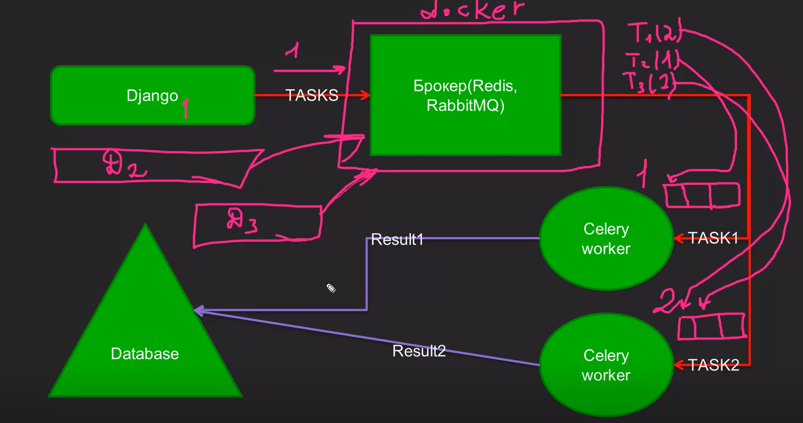
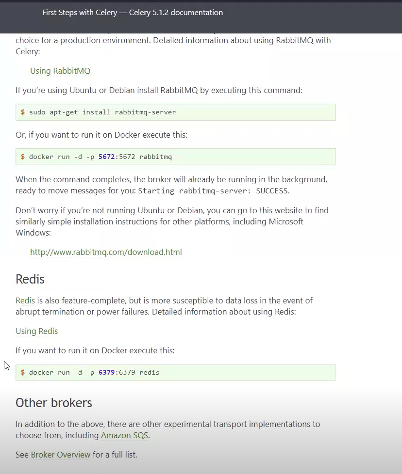
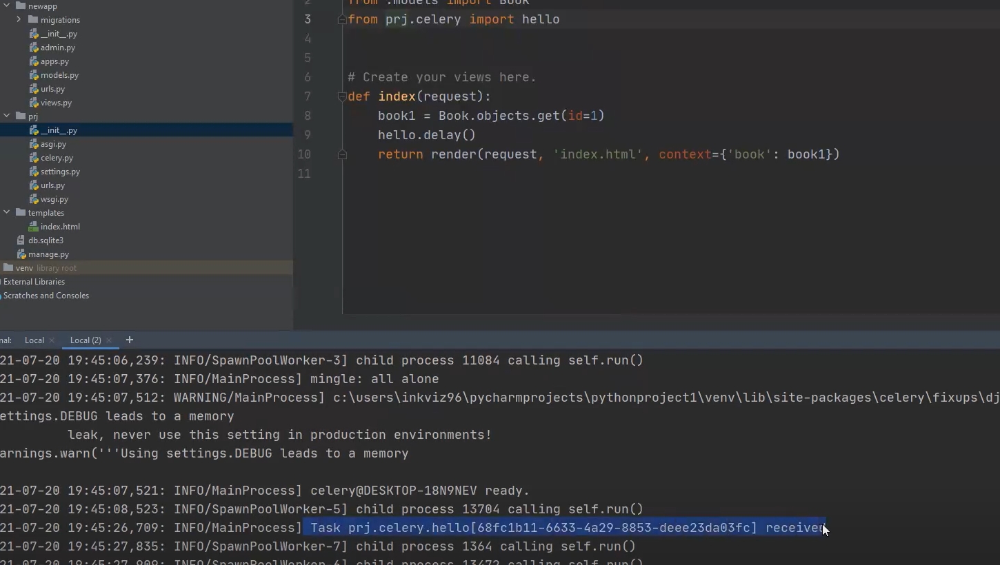

# Docker
`Docker` - программное обеспечение для автоматизации развёртывания и управления приложениями в средах с поддержкой контейнеризации. Докер позволяет "упаковывать" приложение со всем его окружением и зависимостями в контейнер, который может быть перенесён на любую Unix-систему с поддержкой cgroups в ядре, а также предоставляет среды по управлению контейнерами.

- Docker - виртуальная машина с Linux-ядром. 
- Контейнер - обособленная среда с конкретным воспроизводимым функционалом (развёртывание контейнера).

# Redis

`Redis` - резидентная NoSQL-СУБД с открытым исходным кодом, работающая со структурами данных типа <ключ-значение>.

- **резидентная** - значит, что основное хранилище данных находится в оперативной памяти (RAM) - то есть система работает преимущественно с данными в памяти, а не на диске.

- **NoSQL** - не используют SQL, неструктурированные, представление данных в виде агрегатов, достаточно новые, скоростные + масштабируемые + высокая пропускная способность (количество операций, которые система может обрабатывать за единицу времени, в данном случае - сколько запросов система выполняет в секунду).

- - **неструктурированные** - хранит данные в виде ключ-значение, быстрый доступ, можем изменять.

- - **высокая пропускная способность** -  (количество операций, которые система может обрабатывать за единицу времени, в данном случае - сколько запросов система выполняет в секунду).
- - **представление данных в виде агрегатов** - в NoSQL-базах означает, что данные хранятся как целостные, самодостаточные объекты, содержащие всю необходимую информацию для конкретной бизнес-сущности. Агрегат - целостная единица хранения данных, объединяющая логически связанные элементы в один объект.

В NoSQL (агрегатный подход)
Один документ/агрегат содержит всё сразу:
```json
{
  "order_id": "12345",
  "customer_name": "Иван Иванов",
  "order_date": "2023-10-01",
  "items": [
    {
      "product_id": "P001",
      "product_name": "Ноутбук",  // дублирование данных
      "quantity": 1,
      "price": 50000
    }
  ],
  "total_amount": 50000,
  "payment": {
    "method": "card",
    "status": "completed"
  }
}
```

Redis использует NoSQL, потому что Celery и подобные задачи, использующие брокеров, они, как правило, очень серьёзно нагружают сервисы (SQLite) и SQL не может справится с этими нагрузками.


`Брокер` (англ. broker - посредник) - центральная промежуточная часть ПО, распределяющая сообщения. Это некая прослойка, позволяющая распределять задачи по "работникам" (сервисам), которые их будут выполнять.


# Celery
`Celery` - асинхронная очередь задач или очередь заданий, основанная на распределённой передачи сообщений. Ориентирован на работу в реальном времени, но поддерживает и планировщик задач.

## Для чего нужен Celery
- Отдельные фоновые задачи 
- Пакетные обработки задач (запуск сразу множества задач)
- Периодические задачи (рассылка, прослушка)
- Триггерная архитектура

## Правила написания task
- Минимум логики в задаче
- Передача только маленьких скалярных данных (скаляр - ступенчатый, это величина, полностью определяемая одним числом и не имеющаянаправления; скалярные данные - данные, представленные одиночными значения без внутренней структуры: дилна (5 м), масса (10 кг)). 
Пример: лучше не делать много запросов вычислений почты пользователя через ORM, а за пределами получить данные и прокинуть их в таск.

- Обратная совместимость между релизами
- Обязательно предоставлять soft limit timeout и expires

## Проблемы Celery
- Отсутствие автоматической перезагрузки кода при разработке 
- Поддержка task lock (если есть одинаковые задачи, только одна задача выполняется в один момент времени)
- Rate limit для одной задачи
    
### rate limit
rate limit - ограничение частоты - настройка Celery, ограничивающая количество выполнений конкретной задачи за определённый период времени, правило "не чаще N раз в M секунд/минут/часов. 

**Как работает**
1. Устанавливаем для задачи `send_email` ограничение `2/m` (не чаще 2 раз в минуту);
2. Когда в очередь поступает 5 вызовов этой задачи подряд, Celery:
- Сразу запускает первые две
- Остальные 3 ставит в очередь с задержкой - они будут запущены позже, когда истекает период ограничения.
3. Celery автоматические рассчитывает момент запуска следующей задачи, чтобы не превысить лимит.

# Схема работы Django + Broker (Redis, RabbitMQ) + Celery




# Работа с Celery
1. Установка Celery
```python
pip install celery
```

1.1 Установка Redis
```python
pip install redis
```

2. Устанавливаем Docker (с официального сайта)

3. Разворачиваем Redis в Docker (инструкция на официальном сайте Celery)
```bash
docker run -d -p 6379:6379 redis
```



## Разворачиваем celery
1. Прописываем настройки. 
Создаём файл `celery.py` в приложении
```python
import os

from celery import Celery
from celery import shared_task  # фоновые задачи (возможность асинхронно выполнить код)
from celery.shedules import shedule  # отложенные задачи


# Настройки
os.environ.setdefault('DJANGO_SETTINGS_MODULE', 'project.settings')

# Создаём демон
app = Celery('project')

# Конфигурация для взаимодействия (откуда Celery брать настройки)
app.config_from_object('django.conf:settings', namespace='CELERY')
# app.conf.broker_url = 'redis://localhost:6379/0'  # Захардкоженная настройка при проблемах с подключением Celery (конечный компьютер отверг запрос на подключение), можно вместо localhost 0.0.0.0

# app.conf.broker_transport_options = {'visibility_timeout': 3600}


# Написание задачи
app.autodiscover_tasks()  # автоматическая загрузка задач из всех приложений

@app.task()
def hello():
    print('Hello');

# Коннект к Redis (в settings - 3 шаг)

# Фоновые задачи
@shared_task
def task2():
    return()

# Отложенные задачи
schedule = {
    'task': 'prj.celery.task'
}

```

2. Донастраиваем Celery для работы в Windows
В файле `__init__.py` приложения 
```python
from .celery import app as celery_app

# Правильный поиск task
__all__ = ('celery_app', )
```

3. Коннект к Redis
`settings.py`
```python
BROKER_URL = 'redis://localhost:6379/0'
CELERY_RESULT_BACKEND = 'redis://localhost:6379/0'
```

Дополнительные настройки Celery (из Пульса)
```python
# Celery
CELERY_BROKER_URL = 'redis://localhost:6379/0'  # URL для подключения к Redis # TODO: настроить перед prod
CELERY_RESULT_BACKEND = 'redis://localhost:6379/0'  # Используем Redis для хранения результатов задач 
CELERY_ACCEPT_CONTENT = ['json']  # Формат принимаемых Celery данных
CELERY_TASK_SERIALIZER = 'json'  # Сериализация задач в JSON
CELERY_RESULT_SERIALIZER = 'json'  # Сериализация результатов в JSON
CELERY_TIMEZONE = 'Asia/Yakutsk'

CELERY_POOL = 'gevent'  # celery -A backend worker -l info --pool=threads (но установлен gevent)
CELERY_POOL_RECYCLE = 'None'  # Время жизни worker (3600 по умолчанию)
CELERY_TASK_SOFT_TIME_LIMIT = 60  # Мягкое ограничение времени выполнения задачи (по истечению - предупреждение)
CELERY_TASK_TIME_LIMIT = 120  # Грубое завершение задачи (по истечению - принудительно завершается)

CELERY_BEAT_SCHEDULE = {
    'fetch-depth-data-every-day': {
        'task': 'dashboard.tasks.fetch_data',
        'schedule': crontab(hour=9, minute=00)
    }
}
```

4. Запускаем Celery
```bash
celery -A prj worker -l info
```

5. Запускаем задачу
`views.py`
```python
from .celery import hello

def index(request):
    book1 = Book.objects.get(id=1)
    hello.delay()  # delay запускает задачу
    return render(request, 'index.html', context={'book': book1})
```

7. Запуск отложенной задачи
```bash
celery -A worker beat -l info -P eventlet  # или gevent
```

6. Переходим на страницу (index), видим результат выполнения задачи в логах




## Дополнительно
- В каждом приложении должен быть файл `tasks.py`, где описывается задача
```python
from prj.celery import app

# Описание задачи
@app.task()
def task1():
    return ...
```

- В Celery правильно использовать много очередей в зависимости от задач (не делать 1 очередь).

## flower - инструмент визуализации задач для celery
1. Установка + запуск
```python
pip install flower
```
```bash
celery -A prj flower --port=5555
```
2. Переходим по 127.0.0.1:5555 и видим результаты

- Лучше не светить задачи, если в этом нет необходимости.

- Периодические задачи должны учитывать скорость своего выполнения (если рассылка по поводу ДР на 10 000 человек будет идти 2 часа, а нужно через 40 минут, то это будет неактуально). Нужно продумывать конфиги исходя из контекста задачи. 

- Не стоит засовывать начальные данные (ORM-запросы) в таск, так как они будут происходить в каждой задаче.

