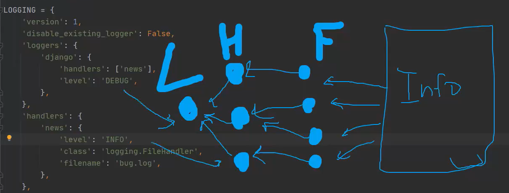
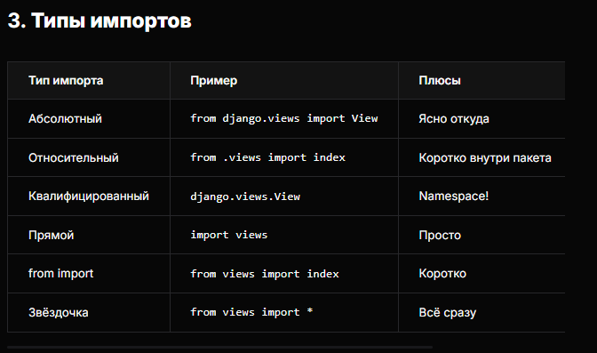
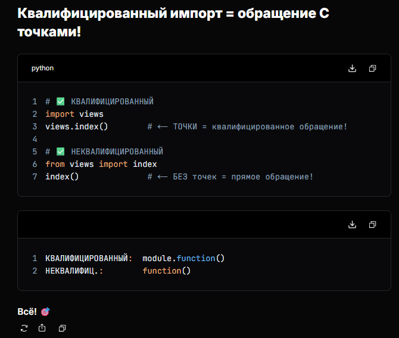
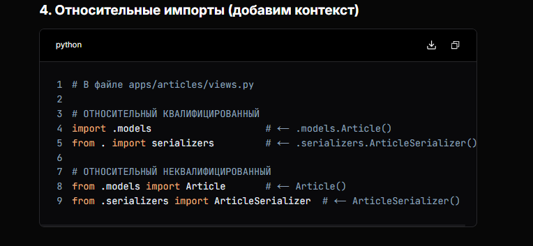

- Миграции - файлы для настройки базы данных, которые указывают базе, как и какая информация будет в ней хранится.
- asgiref Поддержка асинхронности (ASGI)
- pkg-resources	- Управление метаданными пакетов (часть setuptools)
- pytz - Работа с часовыми поясами
- setuptools - Сборка и установка пакетов
- sqlparse - Анализ и форматирование SQL‑запросов


- csrf token - CSRF (Cross-Site Request Forgery) — атака, когда злоумышленник заставляет авторизованного пользователя выполнить нежелательное действие.

- Дженерики

- SQLAlchemy

- Оптимизация ORM-запросов в Django

- Celery + разница shared_task и shedules

- OpenID, OAuth 1.0, OAuth 2.0


# Логирование
Логирование, или ведение журнала, - это процесс записи информации в файлы журнала (или другие источники). Эта информация содержит описание событий, которые произошли в операционной системе или программном обеспечении.


5 уровней логирования:
- DEBUG -10
- INFO -20
- WARNING -30
- ERROR (влияют на работу приложения) -40
- CRITICAL (упал сервер) -50

## Виды логирования
1. Логгеры. Объекты из стандартной библиотеки Python `logging`, которые используются для записи событий, ошибок, отладочной информации и других сообщений в лог-файлы или консоль. Позволяют гибко настраивать уровни логгирования, обработчики и форматы вывода.
2. Хэндлеры (обработчик, определяющий поведение логгеров - вывод в консоль, записать в файл). Определяют хранение и вывод логгеров.
3. Фильтры (дополнительный контроль, какие сообщения будут переданы из логгера в обработчик - например, обрабатываем только "error")
4. Форматтеры (внешний вид лога)

**У одного логгера может быть несколько хэндлеров**

## Настройка логгеров
settings.py
```python

LOGGING = {
    'version': 1,
    'disable_existing_logger': False,  # вкл/выкл дебаг джанго
    # Логгеры
    'loggers': {
        'django': {
            # Сюда можно передавать версию, логгеры, хэндлеры, фильтры, форматтеры, disable_existing_logger

            'handlers': ['news'],  # Название приложения
            'level': 'DEBUG',
        },
    },
    # Обработчики
    'handlers': {
        'console': {
            'class': 'logging.StreamHandler',  # Вывод DEBUG в консоль
        },
        # Имя приложения
        'news' : {
            'level': 'INFO',
            'class': 'logging.FileHandler',  # способ обработки хэндлера
            'filename': 'debug.log',
            'formatter': 'myformatter',
            'filters': ['require_debug_false',],
        },
    },
    # Форматтеры
    'formatters': {
        'myformatter': {
            'format': '{ levelname } { message } { asctime }',
            'datetime': '%Y.%m.%d %H:%M:%S',
            'style': '{',
        },
    },
    # Фильтры
    'filters': {
        'require_debug_false': {
            '()': 'django.utils.log.RequireDebugFalse',
        },
        # 'require_debug_true': {
        #     '()': 'django.utils.log.RequireDebugTrue,
        # }
    }
}

```

views.py
```python
import logging

logger = logging.getLogger(__name__)  # __name__ берёт название приложения как имя логгера

def index(request):
    logger.info('INFO')
    news = New.objects.all()
    return render(request, 'index.html', context={'news': news})
```

В итоге создаётся файл `debug.log`, в который при переходе на страницу с view будет записываться лог


### try/except в логгировании
views.py
```python

def index(request):
    try:
        news = News.objects.all()
    except Exception as E:
        logger.error(E)
    return render(request, 'index.html', context={'news': news})
```

## Принцип работы оповещений



# Пакеты
`Пакеты` - различные компоненты программного обеспечения

`Система управления пакетами` - набор программного обеспечения, позволяющего управлять процессом установки, удаления, настройки и обновления программного обеспечения.


# Контекст
context - python-словарь `{'key': value}`, который Django передаёт в шаблон для рендера
```python
context = {
    'object_list': <QuerySet>,
    'page_obj': <Page>,
    'categories': <QuerySet>,
}
return render(request, 'template.html', context)
```

# Дженерики
Дженерики - готовый классы-представления для типичных задач (CRUD), избавляющие от написания boilerplate-кода. 

**Основные группы**
- ListView
- DetailView
- CreateView
- UpdateView
- DeleteView
- SearchView
- ArchiveView
- YearArchiveView, MonthArchive

## Полный CRUD

views
```python

from django.view.generic import (ListView, DetailView, CreateView, UpdateView, DeleteView)
from django.urls import reverse_lazy
from .models import Article

# Список
class ArticleListView(ListView):
    model = Article
    paginate_by = 10

# Детали
class ArticleDetailView(DetailView):
    model = Article

# Создание
class ArticleCreateView(CreateLiew):
    model = Article
    fields = ['title', 'content', 'category']
    success_url = reverse_lazy('article_list')

# Редактирование
class ArticleUpdateView(UpdateView):
    model = Article
    fields = ['title', 'content', 'category']
    success_url = reverse_lazy('article_list')

# Удаление
class ArticleDeleteView(DeleteView):
    model = Article
    success_url = reverse_lazy('article_list')
```

urls
```python
urlpatterns = [
    path('articles/', ArticleListView.as_view(), name='article_list'),
    path('articles/<int:pk>', ArticleListView.as_view(), name='article_detail'),
    path('articles/new/', ArticleCreateView.as_view(), name='article_create'),
    path('articles/<int:pk>/edit/', ArticleUpdateView.as_view(), name='article_update'),
    path('articles/<int:pk>/delete/', ArticleDeleteView.as_view(), name='article_delete'),
]
```

## Пример расширенной настройки
```python
class ArticleListView(ListView):
    model = Article
    context_object_name = 'articles'
    paginate_by = 10
    template_name = 'articles/list.html'

    def get_queryset(self):
        """Фильтрация + поиск"""

        # queryset - данные

        queryset = Article.objects.filter(published=True)
        search = self.request.GET.get('search')
        if search:
            queryset = queryset.filter(title__icontains=search)
        return queryset.order_by('-created_at')

    def get_context_data(self, **kwargs):
        """Дополнительный контекст"""

        # context - словарь для шаблона

        # 1. Категории для фильтра
        context['categories'] = Category.objects.all()
        
        # 2. Поисковый запрос
        context['search_query'] = self.request.GET.get('search', '')
        
        # 3. Статистика
        context['total_articles'] = Article.objects.filter(published=True).count()
        
        # 4. Рекомендации
        context['recommended'] = Article.objects.filter(
            category__popular=True
        )[:3]
        
        return context
```

**разница context и queryset**
```python
queryset  =  "коробка с яблоками"  (данные)
context   =  "поднос с коробкой + вилка + салфетка"  (данные + допы)

Шаблон видит только поднос (context)!
```

Пример
```python

class ArticleListView(ListView):
    model = Article
    template_name = 'articles/list.html'
    
    # 1. context_object_name - ИМЯ переменной в шаблоне (вместо object_list)
    context_object_name = 'articles'
    
    # 2. queryset - кастомный QuerySet
    queryset = Article.objects.filter(published=True).order_by('-created_at')
    
    # 3. paginate_by - пагинация
    paginate_by = 10
    paginate_orphans = 2
    
    # 4. get_queryset() - динамический queryset
    def get_queryset(self):
        queryset = super().get_queryset()
        search = self.request.GET.get('search')
        if search:
            queryset = queryset.filter(title__icontains=search)
        return queryset

```

Пример с фильтрацией и поиском
```python
class ArticleListView(ListView):
    model = Article
    template_name = 'articles/list.html'
    context_object_name = 'articles'
    paginate_by = 10
    
    def get_context_data(self, **kwargs):
        context = super().get_context_data(**kwargs)
        context['search_query'] = self.request.GET.get('search', '')
        return context
    
    def get_queryset(self):
        queryset = Article.objects.all()
        search = self.request.GET.get('search')
        category = self.request.GET.get('category')
        
        if search:
            queryset = queryset.filter(
                models.Q(title__icontains=search) |
                models.Q(content__icontains=search)
            )
        
        if category:
            queryset = queryset.filter(category__slug=category)
            
        return queryset.order_by('-created_at')
```

Пример с вебинара
```python
from django.shortcuts import get_object_or_404
from .models import Author

class AuthorList(ListView):
    model = Author
    context_object_name = 'Authors'
    template_name = 'newapp/authors.html'

    def get_queryset(self):
        self.authorUser = get_object_or_404(Author, name=self.args[0])
        return Author.objects.filter(authorUser=self.authorUser)
```


# Типы импортов








## Правила использования импортов

1. From-импорт конкретных объектов (80% случаев) - неквалифицированное обращение

```python
from django.shortcuts import render, redirect, get_object_or_404
from django.views.generic import ListView, DetailView
from .models import Article, Category

def view(request):
    return render(request, 'template.html')
```

2. Утилиты, логирование, конфиг - прямое обращение
```python
import logging
import os
from pathlib import Path

logger = logging.getLogger(__name__)
```

3. Относительный импорты - внутри приложения


# get_absolute_url
Метод `get_absoulte_url()` - это стандартный способ получения полного URL для модели. Он возвращает абсолютный URL (с доменом и протоколом), который можно использовать для ссылок, RSS, API и т.д.

1. Метод должен быть определён в модели и возвращать строку с абсолютным URL
```python
from django.urls import reverse
from django.db import models

class Article(models.Model):
    title = models.CharField(max_length=200)
    slug = models.SlugField(max_length=200)

    def get_absoulte_url(self):
        # Возвращает полный URL для конкретного экземпляра
        return reverse('article_detail', kwargs={'slug': self.slug})
```

Комментарий: `article_detail` - это имя URL-паттерна (name). Reverse ищет только по имени. 

В файле urls.py
```python
urlpatterns = [
    # article_detail - это имя URL (name='article_detail')
    path('articles/<slug:slug>/',
        ArticleDetailView.as_view(),
        name='article_detail'),  # Это имя URL
]
```


2. Автоматическая работа Django Admin
Django Admin автоматически использует этот метод
```python
"View on site" -> https://example.com/articles/my-article
```

3. Пример использования
**Вью**
```python
def article_list(request):
    articles = Article.objects.all()
    return render(request, 'articles.html', context={'articles': articles})
```


**Шаблон**
```html
<!-- Получаем URL для каждой статьи -->
<a href="{{ article.get_absolute_url }}">{{ article.title }}</a>

<!-- Список статей -->

    <li><a href="{{ article.get_absolute_url }}">{{ article.title }}</li>

```

3. Пример использования во вью c классом (спорно)
```python
class ArticleCreateView(CreateView):
    model = Article
    fields = ['title', 'slug', 'content']

    def get_success_url(self):
        # Возвращаем URL новосозданной статьи!
        new_article = self.object
        return new_article.get_absoulute_url()
```

## Варианты реализации
1. ID
```python
def get_absolute_url(self):
    return reverse('article_detail', kwargs={'pk': self.pk})
```

2. slug
```python
def get_absolute_url(self):
    return reverse('article_detail', kwargs={'slug': self.slug})
```

3. С дополнительными параметрами
```python
def get_absolute_url(self):
    return reverse('article_detail', kwargs={
        'year': self.pub_date.year,
        'month': self.pub_date.month,
        'slug': self.slug
    })
```


 