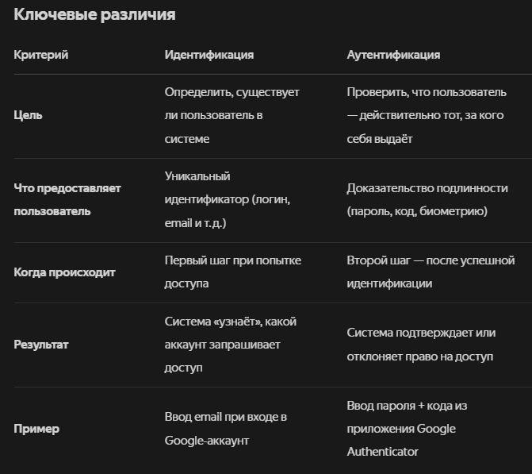
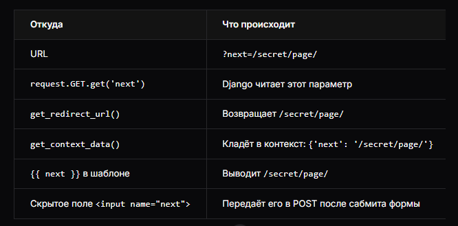

# Вход

## Маршруты
`backend/urls.py`
```python
from django.urls import path, include

urlpatterns = [
    path('accounts/', include('django.contrib.auth.urls')),
]
```

## Настройки
`backend/settings.py`
```python
LOGIN_REDIRECT_URL = "/"  # Страница после успешного входа
```

## Создание шаблона
`templates/accounts/login.html`
```html




<form method="post" action="">

    {{ form.as_p }}
    <input type="submit" value="login">  <!-- Кнопка отправки -->
    <input type="hidden" name="next" value="{{ next }}">  <!-- Куда редиректить -->
</form>


```
- Параметр `<input type="hidden" name="next" value="{{ next }}">` нужен потому, что многие сайты хотят после успешного входа вернуть пользователя туда, откуда он пришёл (например, на страницу, которую он пытался открыть до того, как его перенаправили на форму входа).
- `name="next"` - ключ, который Django ищет в POST/GET
- `value="{{ next }}"` - значение из адресной строки. Строка могла иметь вид: `<input type="hidden" name="next" value="/secret/page/">`, когда пользователь жмёт кнопку, браузер отправляет:
```
POST /accounts/login/
username=admin&password=123&next=/secret/page
```
Как итог, в контекст шаблона попадает:
```python
{'next': '/secret/page/'}
```


- `{{ next }}` - значение из контекста шаблона, которое добавляет `LoginView`
```python
# django/views/generic/base.py - FormView.get_context_data()
def get_context_data(self, **kwargs):
    context = super().get_context_data(**kwargs)
    # Добавляет next в контекст
    context[self.redirect_field_name] = self.get_redirect_url()
    return context
```

### Как работает {{ next }}
Шаг-1. Пользователь пытается открыть защищённую страницу
```bash
GET /secret/page/
```

Шаг-2. Django видит, что нужно войти. Делает редирект:
```python
GET /accounts/login/?next=/secret/page/
```

Шаг-3. В `LoginView` срабатывает `get_context_data()`:
```python
def get_context_data(self, **kwargs):
    context = super().get_context_data(**kwargs)
    context.update(
        {
            self.redirect_field_name: self.get_redirect_url(),
            # redirect_field_name = 'next'
        }
    )
    return context
```

Шаг-4. `get_redirect_url()` читает `?next=` из адреса:
```python
class RedirectURLMixin:
    ...

    def get_redirect_url(self):
        """Return the user-originating redirect URL if it's safe."""
        redirect_to = self.request.POST.get(
            self.redirect_field_name, self.request.GET.get(self.redirect_field_name)
        )
        url_is_safe = url_has_allowed_host_and_scheme(
            url=redirect_to,
            allowed_hosts=self.get_success_url_allowed_hosts(),
            require_https=self.request.is_secure(),
        )
        return redirect_to if url_is_safe else ""
```

Шаг-5. В контекст шаблона попадает:
```python
{'next': '/secret/page/'}
```

Шаг-6. В шаблоне `{{ next }}` выводит `/secret/page/`.

Визуально
```
Browser                          Django                      Template
  |                               |                           |
  | GET /secret/page/             |                           |
  |------------------------------>|                           |
  |                               |                           |
  |                        Redirect:                         |
  |   /accounts/login/?next=/secret/page/                   |
  |<-----------------------------|                           |
  |                               |                           |
  | GET /accounts/login/?next=/secret/page/                 |
  |------------------------------>|                           |
  |                               |  get_context_data()       |
  |                               |  берёт next из GET        |
  |                               |-------------------------->|
  |                               |                           |
  |                        Render: login.html                |
  |                        {{ next }} = '/secret/page/'       |
  |<------------------------------|                           |
  |                               |                           |
  | <input value="{{ next }}">    |                           |
  | (скрытое поле = /secret/page/)                           |
  |                               |                           |

```




# Регистрация

## Новое приложение
```
python manage.py startapp auth
```

## Форма регистрации пользователя
`auth/forms.py`

```python
from django import forms
from django.contrib.auth.forms import UserCreationForm
from django.contrib.auth.models import User

class SignUpForm(UserCreationForm):
    email = forms.EmailField(label="Email")
    first_name = forms.CharField(label="Имя пользователя")
    last_name = forms.CharField(label="Фамилия")

    class Meta:
        model = User
        fields = (
            "username",
            "first_name",
            "last_name",
            "email",
            "password1",
            "password2",
        )
```

## Представление
`auth/viws.py`

```python

from django.contrib.auth.models import User
from django.views.generic.edit import CreateView
from .forms import SignUpForm

class SignUpView(CreateView):
    model = User
    form = SignUpForm
    success_url = '/auth/login'
    template_name = 'registration/signup.html'

```

## Шаблон
`registration/signup.html`
```python



<form method="post">

    {{ form.as_p }}
    <input type="submit" value="Sign up">
</form>


```

## Маршруты приложения
`auth/urls.py`
```python
from django.urls import path
from .views import SignUpView

urlpatterns = [
    path('signup/', SignUpView.as_view(), name='signup'),
]
```

## Маршруты проекта
`backend/urls.py`
```python

from django.contrib import admin
from django.urls import path, include

urlspatterns = [
    path("admin/", admin.site.urls),
    path("auth/", include('django.contrib.auth.urls')),
    path("auth/", include('auth.urls')),  # Добавили эту строчку
]
```