## Плюсы и минусы Django

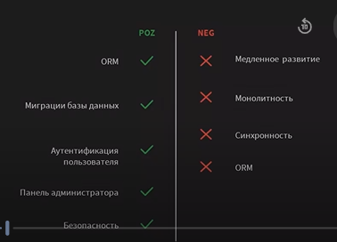

## apps.py
apps.py - файл конфигурации приложения Django. Содержит класс конфигурации (AppConfig), который задаёт метаданные и настройки приложения, а также позволяет вмешаться в процесс запуска Django.

Нужен для:
- структурированной информации в приложении
- безопасного выполнения инициализационного кода
- интеграции с Django без циклических зависимостей
- тонкой настройки поведения приложения в проекте


# Созадние моделей 

## Промежуточная таблица

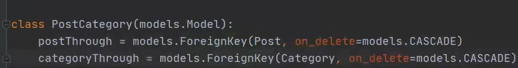


## Модель Post

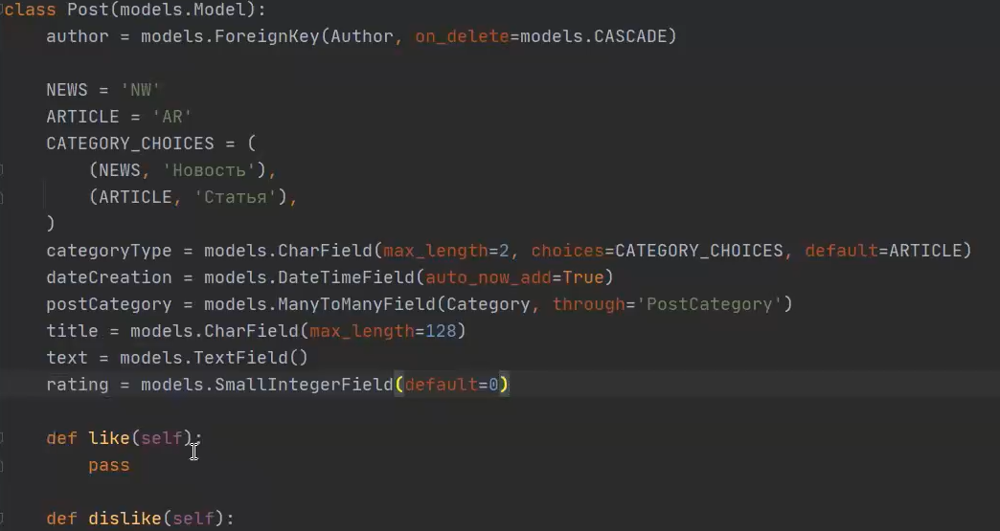

## update rating

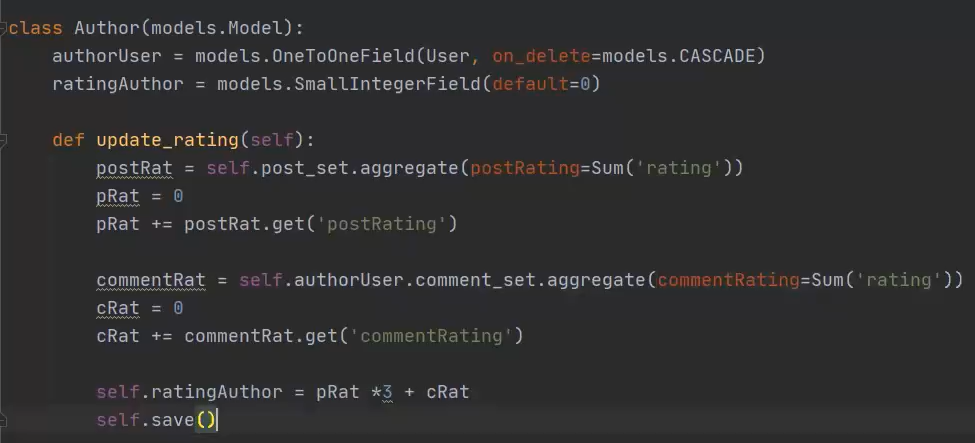

## Обращение к связанным полям

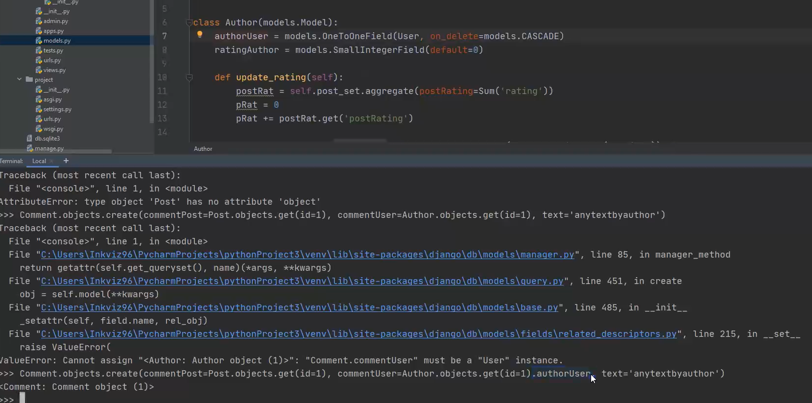

## Вывод пользователя с самым низким рейтингом

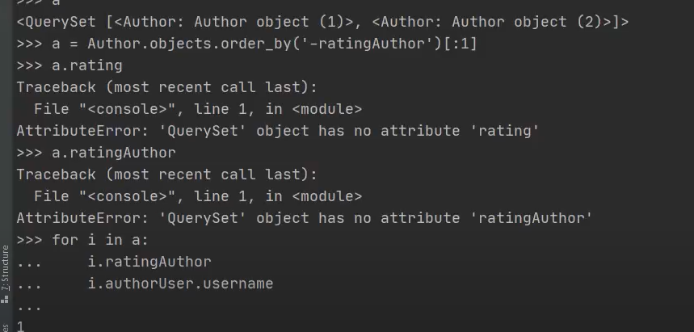

## Пример промежуточной модели
```python
from django.db import models
from datetime import date

class Employee(models.Model):
    name = models.CharField(max_length=100)

    def __str__(self):
        return self.name

class Project(models.Model):
    title = models.CharField(max_length=200)
    employees = models.ManyToManyField(
        Employee,
        through='Assignment'  # Указываем промежуточную модель
    )

    def __str__(self):
        return self.title

class Assignment(models.Model):  # Промежуточная модель
    employee = models.ForeignKey(Employee, on_delete=models.CASCADE)
    project = models.ForeignKey(Project, on_delete=models.CASCADE)
    date_assigned = models.DateField(default=date.today)
    role = models.CharField(max_length=50, default='Participant')

    class Meta:
        unique_together = ('employee', 'project')  # Уникальность связки

    def __str__(self):
        return f"{self.employee} in {self.project} as {self.role}"
```

## Заменить дефолтный primary key

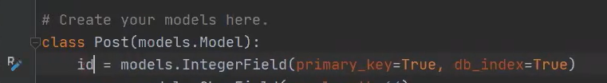

## self в моделях

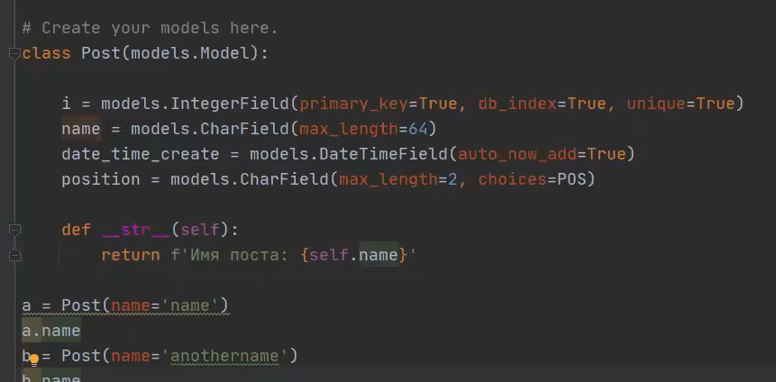

## Типы полей

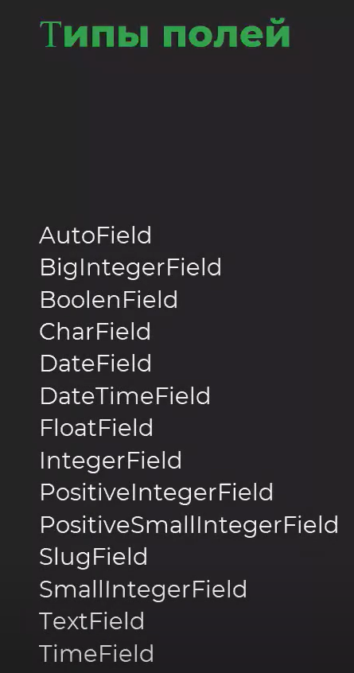

## Лучшая практика комбинирования шаблонов

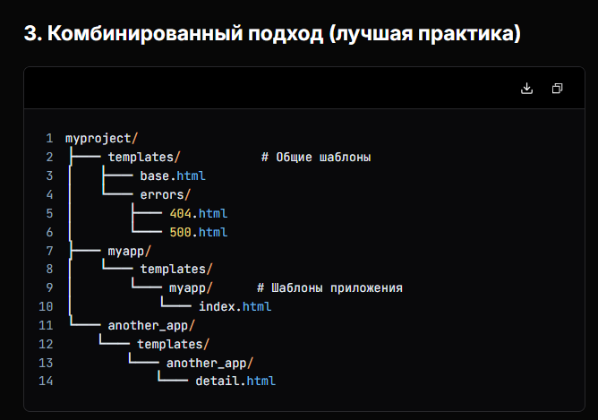

## null=True vs blank=True

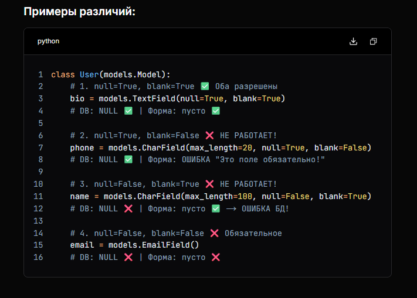

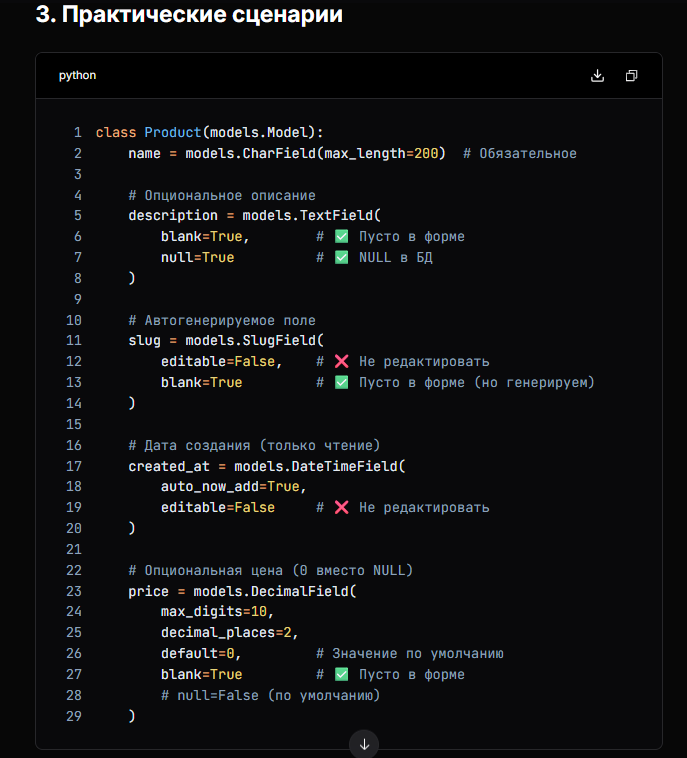

## Пример моделей боевого проекта

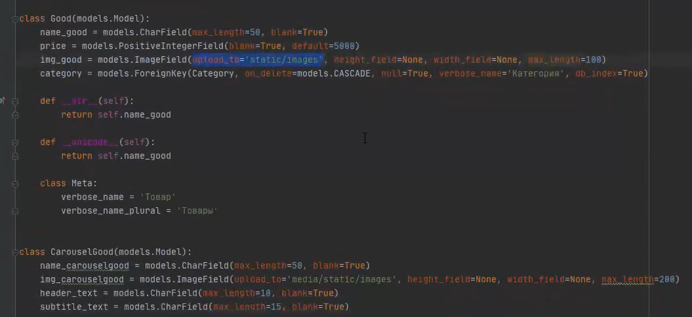